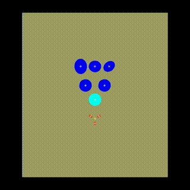
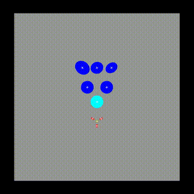

# Quasi-Static Push Simulation
- This project provides quasi-static push simulation with Python bindings.
- It allows users to simulate object pushing and grasping, retrieve simulation states, visualize the environment, and record and replay simulations.

<div align="center">

[](https://www.python.org/downloads/release/python-310/)
&nbsp;&nbsp;&nbsp;&nbsp;
[](https://opensource.org/licenses/MIT)
</div>

<div align="center">
  <table>
    <tr>
      <td align="center">
        
        <br><b>Mode 0: Initial State</b>
      </td>
      <td align="center">
        
        <br><b>Mode 1: Gripper Interacting with Sliders</b>
      </td>
      <td align="center">
        
        <br><b>Mode 2: Gripper Attempting to Grasp</b>
      </td>
    </tr>
  </table>
</div>

## 1. Overview
The quasi_static_push module is a physics-based simulation engine that enables object pushing and grasping simulations.
Users can control pushers and sliders in a 2D simulation environment with visualization, collision detection, and recording features.

### Key Features
- Quasi-static object pushing and grasping simulation
- Simulation termination detection
- Image rendering and state retrieval
- Support for recording and replaying simulation frames
- Keyboard and programmatic interaction support

## 2. Build Instructions
To use the simulation module, you need to build the .so shared library first.
Follow these steps to generate the shared library for Python.

1. **Install the code**
   ```bash
   git clone https://github.com/HJS-HJS/quasi-static-push-cpp.git
   ```

2. **Build the requirements**
    ```bash
    sudo apt-get install libsdl2-dev libsdl2-gfx-dev libopencv-dev -y
    ```

    - install nlohmann
    ```bash
    sudo apt install nlohmann-json-dev
    ```
    - if you cant install nlohmann
    ```bash
    mkdir -p external/nlohmann
    curl -L https://raw.githubusercontent.com/nlohmann/json/develop/single_include/nlohmann/json.hpp -o external/nlohmann/json.hpp
    ```

3. **Install the python libraries**
    ```bash
    pip install -r requirements.txt
    ```

4. **Build Process**
    ```bash
    mkdir -p build
    cd build
    cmake ..
    make -j$(nproc)
    ```

After the build is complete, you will find the [/build/quasi_static_push.so](./build/build/quasi_static_push.so) file.

## 3. How to use
### 1. Using .so File in Python
Once built, you can use the .so file in Python as follows:

```python
import quasi_static_push
```

### 2. Initialize the simulation viewer
```python
sim = quasi_static_push.SimulationViewer()
```

### 3. Run a single simulation step
```python
sim_result = sim.run([0.1, 0.0, 0.0, 0.0, 0.0])
```
- Input format:
  - run([vx, vy, omega, gripper_action, mode_change])
    - vx (float): Linear velocity in the x-direction [m/s]
    - vy (float): Linear velocity in the y-direction [m/s]
    - omega (float): Angular velocity of the pusher (rotation speed) [rad/s]
    - gripper_action (float): Gripper control input (e.g., opening/closing the gripper) [m/s]
    - mode_change (float): Change simulation mode when higher than 0.5

### 4. Print simulation state
```python
print(f"Simulation Done: {sim_result.done}")
print(f"Reasons: {sim_result.reasons}")
```

### 5. Keyboard control
```python
Tuple[np.ndarray, bool, bool] input  = sim.keyboard_input()
```
- Only available when simulation window is not headless
- Keyboard input:
  - Tuple[np.ndarray[float, float, float, float, float], bool, bool]: 
    - First element: An np.ndarray of floats representing input directions.
      - First element: [Float] 1.(-1.) when w(s) key is pressed.
      - Second element: [Float] 1.(-1.) when a(d) key is pressed.
      - Third element: [Float] 1.(-1.) when q(e) key is pressed.
      - Forth element: [Float] 1.(-1.) when right arrow(left arrow) key is pressed.
      - Fifth element: [Float] 1. when spacebar key is pressed.
    - Second element: True when escape key is pressed.
    - Third element: True when r key is pressed.

### 6. Simulation mode
| Mode | Trigger Condition | Behavior |
|------------|--------------------|----------------------|
| `0` | Initial state, or when the fifth input is below 0.5 | Gripper does not interact with sliders. |
| `1` | When the fifth input exceeds 0.5 **and** overlap not occur | Gripper interact with sliders. |
| `2` | When the gripper reaches the target slider in Mode 1 | The gripper attempts to grasp the target slider. |

## 4. Configuring Simulation Parameters in Python
### 1. SimulationViewer Constructor Parameters
```python
sim = quasi_static_push.SimulationViewer(
    window_width=1600,           # Simulation window width (pixels)
    window_height=1600,          # Simulation window height (pixels)
    scale=400.0,                 # Visualization scale (pixels/meters)
    tableWidth=2.0,              # Table width (meters)
    tableHeight=2.0,             # Table height (meters)
    frame_rate=100,              # Simulation frame rate (Hz)
    frame_skip=10,               # Number of frames to skip per step
    grid=True,                   # Enable/disable grid visualization
    grid_space=0.1,              # Grid spacing (meters)
    headless=False,              # Disable rendering for faster execution
    gripper_movement=0,          # Gripper movement mode (0: XY, 1: Move to Target, 2: Move Forward)
    show_closest_point=False,    # Highlight closest contact points
    recording_enabled=True,      # Enable recording scene as video
    recording_path="recordings"  # Path to save recorded video
)
```

### 2. Resetting the Simulation
- Shape
    - The simulation supports different shapes for both **pushers** and **sliders**.  
    - Each shape requires specific parameters, as shown in the table below.
    
    | Shape Name | Required Parameters | Parameter Description |
    |------------|--------------------|----------------------|
    | `circle` | `[x, y, rotation, radius]` | `x, y`: Position, `rotation`: Initial angle, `radius`: Circle radius |
    | `ellipse` | `[x, y, rotation, a, b]` | `a, b`: Semi-major and semi-minor axes |
    | `superellipse` | `[x, y, rotation, a, b, n]` | `a, b`: Semi-major and semi-minor axes, `n`: Exponent (controls shape smoothness) |
    | `rpolygon` | `[x, y, rotation, a, n]` | `a`: Radius, `n`: Number of sides |
    | `smoothrpolygon` | `[x, y, rotation, a, n]` | `a`: Outer radius, `n`: Number of sides |


- Reset
    ```python
    sim.reset(
        slider_inputs=[("circle", [0.0, -0.5, 0.0, 0.45])],
        pusher_input=(3, 120.0, "superellipse", {"a": 0.015, "b": 0.03, "n": 10}, 0.10, 0.185, 0.04, 0.0, -1.2, 0.0),
        newtableWidth=2.0,
        newtableHeight=2.0
    )
    ```
    - Parameter breakdown:
        - slider_inputs (list): Defines the sliders (objects to be pushed)
            - Format: [("shape", shape_param)]
        - pusher_input (tuple): Defines the pusher (gripper)
            - Format: (num_fingers, finger_angle, shape, shape_params, width, maximum_width, minimum_width, x, y, rotation)
            - num_fingers (int): Number of fingers in the gripper
            - finger_angle (float): Angle between fingers
            - width (float): Width of the pusher [meters]
            - maximum_width (float): Maximum width of the pusher [meters]
            - minimum_width (float): Minimum width of the pusher [meters]
            - x (float): Initial x-offset from the center [meters]
            - y (float): Initial y-offset from the center [meters]
            - rotation (float): Initial rotation offset [radians]
        - newtableWidth (float): Width of the simulation table [meters]
        - newtableHeight (float): Height of the simulation table [meters]

## 5. Loading and Replaying Recorded Simulations
To replay a previously recorded simulation, use the Player class.

```python
player = quasi_static_push.Player("recordings")

for is_new_video, sim_result, action in player:
    print(f"New Video: {is_new_video}")
    print(f"Simulation Done: {sim_result.done}")
    print(f"Reasons: {sim_result.reasons}")
    print(f"Action: {action}")
```
- This code iterates through the recorded frames, retrieving simulation states and actions.
- The format of result from player appears in the same format as the result when running the simulation.

## 6. License
This project is licensed under the MIT License.
You are free to use and modify the code, but attribution to the original author is required.

For more details, see the [LICENSE](./LICENSE) file.

## 6. Debug
### ssh OpenGL problem
- case
```bash
X Error of failed request:  BadAlloc (insufficient resources for operation)
  Major opcode of failed request:  152 (GLX)
  Minor opcode of failed request:  5 (X_GLXMakeCurrent)
  Serial number of failed request:  0
  Current serial number in output stream:  105
```

- solve
```bash
export SDL_VIDEODRIVER=dummy
```